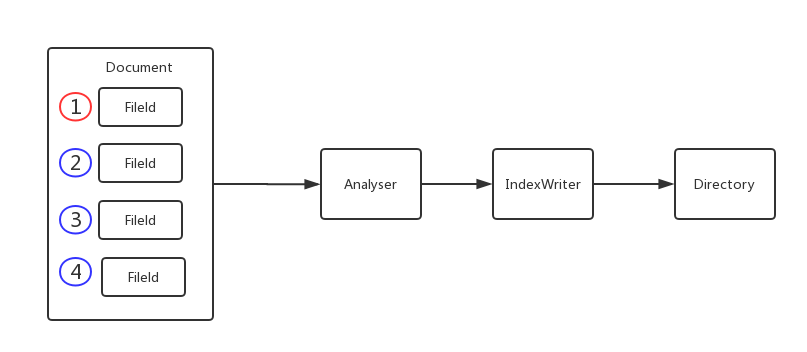

# Antaeus

 - [1 介绍](#1-介绍)
    - [1.1 LIRe介绍](#1.1-lire介绍)
    - [1.2 功能介绍](#1.2-功能介绍)
    - [1.3 数据流图](#1.3-数据流图)
    - [1.4 相关文档](#1.4-相关文档)
 - [2 准备工作](#2-准备工作)
   - [2.1 类Unix系统](#2.1-类unix系统(ubuntu,-centos,-redhat等))
   - [2.2 Windows安装Gradle](#2.2-windows安装gradle)
 - [3 打包运行](#3-打包运行)
    - [3.1 处理依赖](#3.1-将所有依赖包拷贝到-dependencies-文件夹中)
    - [3.2 index](#3.2-index)
    - [3.3 search api service](#3.3-search-api-service)
 - [4 docker 镜像build](#4-docker-镜像)
    - [4.1 Dockerfile](#4.1-dockerfile)
    - [4.2 build镜像](#4.2--build镜像)
    - [4.3 启动容器](#4.3-启动容器)
 
# 1 介绍
   本项目引用部分[LIRe(Lucene Image Retrieval)](doc-offical/README.md)框架源码以及Facebook faiss引擎部分思想，基于Apache Lucene的以图搜图引擎。通过实时接收Kafka中传来的基于MTCNN深度模型人脸识别算法得到512维的特征向量，实时建立索引，并且加入缓存机制，并且支持一定日期范围内（可配置）快速检索。
   为了方便开发和阅读，涉及到项目中的关键词均用英文，比如Document, [Extractor](docs/EXTRACTOR.md), Builder等。
 
## 1.1 LIRe介绍
 LIRE(Lucene Image Retrieval)是一款基于lucene的图像特征索引工具。</br>
 lucene是一个开源的强大的索引工具，但是它仅限于文本索引，LIRe基于lucene对图像特征建立索引和搜索。

### 1.1.1 索引过程
 1. **获取内容(分析图像)**  
 在索引操作期间，图像数据首先被DocumentBuilder对象解析，使用Extractor提取特征，并创建对应的Document实例，该实例包含两个Field实例（图像特征和图像对应的标志字符串），它们都是图像的重要信息。随后的分析过程将域处理成大量语汇单元。最后将语汇单元加入到段结构中。 
 2. **建立文档**   
 使用Lucene索引数据时，必须先从数据中提取纯文本格式信息，以便Lucene识别该文本并建立对应的Lucene文档。
 3. **文档分析**    
 一旦建立其Lucene文档和域，就可以调用IndexWriter对象的addDocument方法将数据传递给Lucene进行索引操作了。在索引操作时，Lucene首先分析文本，将文本数据分割成语汇单元串，然后对它们执行一些可选操作。
 4. **文档索引**  
 在索引步骤中，文档被加入到索引列表。

#### lucene索引详细过程
 1. 在索引操作期间，图像数据首先被DocumentBuilder对象解析，使用Extractor提取特征，并创建对应的Document实例，该实例包含两个Field实例（图像特征和图像对应的标志字符串），它们都是图像的重要信息。随后的分析过程将域处理成大量语汇单元。最后将语汇单元加入到段结构中。 
 2. 提取文本和创建文档 使用Lucene索引数据时，必须先从数据中提取纯文本格式信息，以便Lucene识别该文本并建立对应的Lucene文档。

 
### 1.1.2 索引核心类 
 * IndexWriter  
 索引过程的核心组件。这个类负责创建新索引或者打开已有索引，以及向索引中添加、删除或更新被索引文档的信息。可以把IndexWriter看作这样一个对象：它为你提供针对索引文件的写入操作，但不能用于读取或搜索索引。IndexWriter需要开辟一定空间来存储索引，该功能可以由Directory完成
 * Directory  
 该类描述了Lucene索引的存放位置。它是一个抽象类，它的子类负责具体指定索引的存储路径。用FSDirectory.open方法来获取真实文件在文件系统的存储路径，然后将它们一次传递给IndexWriter类构造方法。IndexWriter不能直接索引文本，这需要先由Analyzer将文本分割成独立的单词才行。
 * Analyzer  
 文本文件在被索引之前，需要经过Analyzer（分析器）处理。Analyzer是由IndexWriter的构造方法来指定的，它负责从被索引文本文件中提取语汇单元，并提出剩下的无用信息。如果被索引内容不是纯文本文件，那就需要先将其转换为文本文档。对于要将Lucene集成到应用程序的开发人员来说，选择什么样Analyzer是程序设计中非常关键的一步。分析器的分析对象为文档，该文档包含一些分离的能被索引的域。
 * Document  
 Document对象代表一些域（Field）的集合。文档的域代表文档或者文档相关的一些元数据。元数据（如作者、标题、主题和修改日期等）都作为文档的不同域单独存储并被索引。Document对象的结构比较简单，为一个包含多个Filed对象容器；Field是指包含能被索引的文本内容的类。
 * Field  
 索引中的每个文档都包含一个或多个不同命名的域，这些域包含在Field类中。每个域都有一个域名和对应的域值，以及一组选项来精确控制Lucene索引操作各个域值。

## 1.2 功能介绍
   * [建立索引](doc-offical/developer-docs/docs/index.md)
   * [检索图像](doc-offical/developer-docs/docs/searchindex.md)
   * 自定义Extractor
 
## 1.3 数据流图
 
 1. 每一张图片对应一个document对象，document对象包含多个Field
 2. Field ①为图像文件的为一id，官网源码默认的是图片的路径（url）
 3. 除了第一个Field，其他Field都与图像特征feature有关，DocumentBuilder在初始化之前可以指定特征提取算法（Extractor），Field ②③④ 分别对应不同的算法提取的特征。
 4. Extractor提取特征的时候，特征使用double[] 存储，后面生成Field时会压缩成byte[] ，因为lucene都是以二进制形式保存数据的。
 5. 以上当一个document对象创建完成后，也就是一张图片解析完之后，会交给lucene来加到索引中去，lucene索引使用的是倒排索引的数据结构。
 6. DocumentBuilder是建立Document的接口类，Document就是lucene中的文档,在本项目中Document对象包含了图像的feature和图像的唯一标识字符串两个Field

 
## 1.4 相关文档
- [LIRe官方README](doc-offical/README.md)
- [search api文档](docs/api.md)
 
# 2 准备工作

### <b>安装Gradle</b>
## 2.1 类Unix系统(Ubuntu, CentOS, RedHat等)
* 安装sdkman(软件管理工具)

```bash
$ curl -s "https://get.sdkman.io" | bash
```
```bash
$ source "$HOME/.sdkman/bin/sdkman-init.sh"
```

* 检查是否安装成功

```bash
$ sdk version
```
* 安装gradle

```bash
$ sdk install gradle 4.7
```

## 2.2 Windows安装Gradle

* 安装chocolatey(windows上的软件安装工具)

    * 使用cmd.exe 
    
    ```bash 
    @"%SystemRoot%\System32\WindowsPowerShell\v1.0\powershell.exe" -NoProfile -InputFormat None -ExecutionPolicy Bypass -Command "iex ((New-Object System.Net.WebClient).DownloadString('https://chocolatey.org/install.ps1'))" && SET "PATH=%PATH%;%ALLUSERSPROFILE%\chocolatey\bin"
    ```
    * 使用PowerShell.exe 
    
    首先运行
    ```bash
    Get-ExecutionPolic
    ```
    如果返回
    ```bash
    Restricted
    ```
    则运行
    ```bash
    Set-ExecutionPolicy AllSigned 或者 Set-ExecutionPolicy Bypass -Scope Process
    ```
    最后运行
    ```bash
    Set-ExecutionPolicy Bypass -Scope Process -Force; iex ((New-Object System.Net.WebClient).DownloadString('https://chocolatey.org/install.ps1'))
    ```
* 安装Gradle
```bash
choco install gradle
```  
  
# 3 打包运行
## 3.1 将所有依赖包拷贝到 dependencies 文件夹中

```bash
$ gradle copyJar
```
在build/libs中会生成 Antaeus-1.0.jar

```bash
$ gradle build
```

## 3.2 运行

### index 支持两种方式
  * kafka消息队列接收  
  * 输入本地图像所在文件夹自动建立索引  


### kafka消息队列接收

#### 运行指令 
最后一个参数是需要index的图片文件夹路径
```bash
$ cd /home/Antaeus
$ java -cp build/libs/Antaeus-1.0.jar  com.oceanai.main.AntaeusServer index.json
```
or

```bash
$ cd /home/Antaeus
$ ./start.sh -antaeus
```

#### kafka消息格式

对象数据结构

```java
public class IndexMessage {
    private String id;
    private double[] feature;
}
```

```json
{"id":"0","feature":[0.06056745,0.01256264,...,510 values more]}
```
```json
[{"id":"14,02607d203666","feature":[-0.08406701683998108,...]},
{"id":"14,02607d203666","feature":[-0.08406701683998108,...]}]
```

### 输入本地图像所在文件夹自动建立索引  


```bash
$ java -cp build/libs/Antaeus-1.0.jar  net.semanticmetadata.lire.lire.Indexer images/
```

详细请见[search api文档](docs/api.md)


# 4 docker 镜像

## 4.1 Dockerfile
```bash
FROM antaeus-base 

MAINTAINER wangrupeng wangrupeng@live.cn

EXPOSE 28888

MAINTAINER wangrupeng wangrupeng@live.cn

COPY Antaeus /home/Antaeus

WORKDIR /home/Antaeus
```

## 4.2  build镜像
```bash
docker build -t image-antaeus ./
```
/etc/init.d/OpenSSL start
